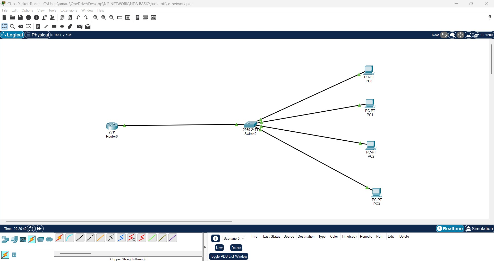

# 🖧 Basic Office Network - Cisco Packet Tracer

## 📌 Overview

This project demonstrates the design and implementation of a basic LAN network using Cisco Packet Tracer.

## ⚙️ Configuration

* Configured router with IP address 192.168.1.1
* Assigned IP addresses to PCs
* Connected devices using a switch

## 🧪 Testing

* Verified connectivity using ping command

## 📸 Topology

## 🚀 Outcome

All devices successfully communicated within the network.
